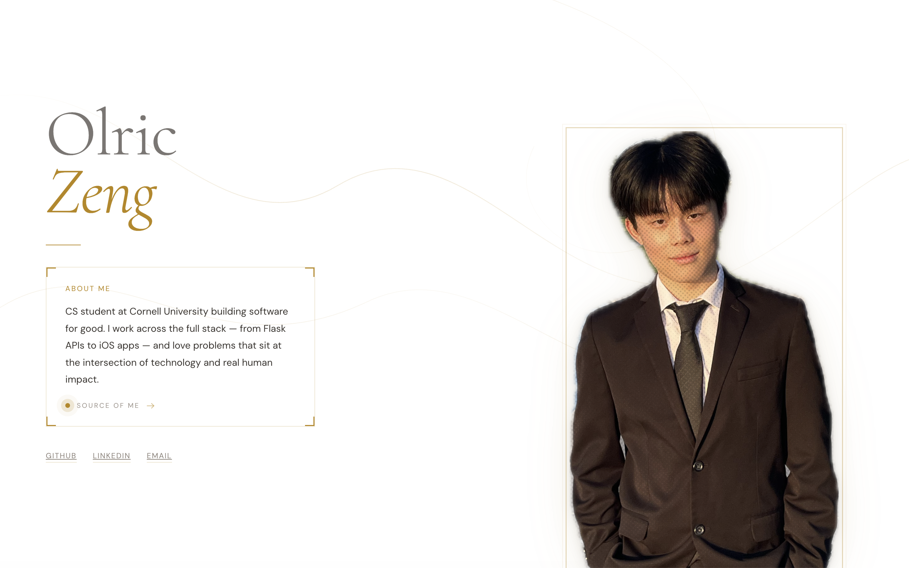

# About Me
Hi, I'm Olric Zeng, a Computer Science student at Cornell University.  
I build **full-stack web applications**, backend APIs, and cross-platform mobile apps, with a focus on clean architecture and real-world impact.

My work spans software engineering, backend API design, ML-powered applications, and non-profit tech.

# Personal Portfolio
Check out my [personal portfolio website!](https://www.olriczeng.com/)

